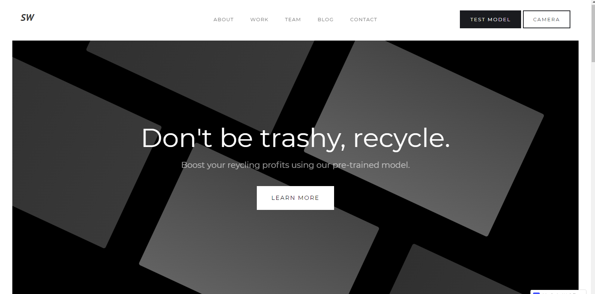
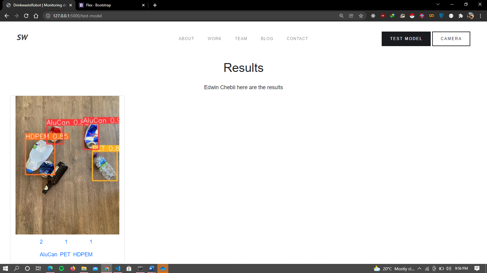
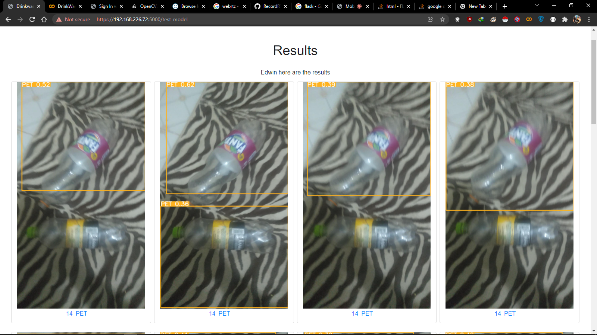
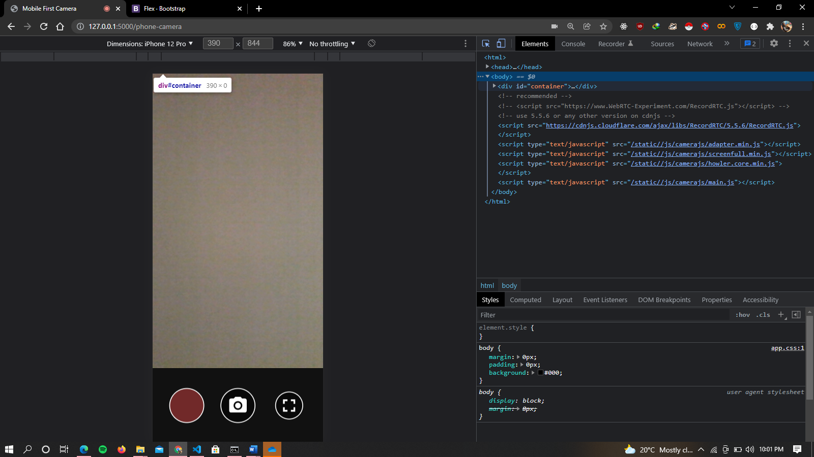
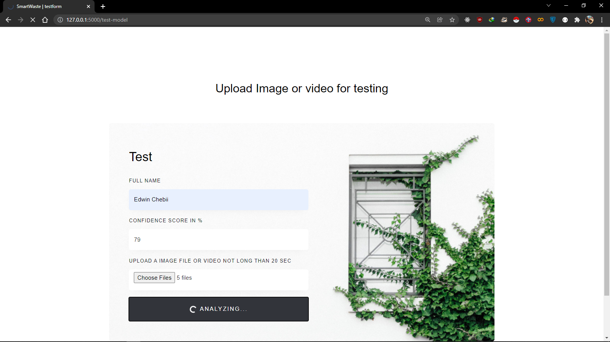

# Introduction

This project aims to leverage artificial intelligence (AI) to detect waste materials, with potential applications in recycling plants, as well as the development of waste-collecting devices and robots. The accompanying website serves as a demonstration of how this technology can be implemented effectively.

## Technology Stack

- **Object Detection Model**: We employ YOLOv5, a powerful object detection model, to identify waste materials.
- **Dataset**: Our gratitude goes to Kaggle for providing access to the [Drinking Waste Classification dataset](https://www.kaggle.com/datasets/arkadiyhacks/drinking-waste-classification). This dataset includes contributions from Gary Thung and Mindy Yang, who manually collected portions of it. Their dedication to this task is greatly appreciated. You can find their repository [here](https://github.com/garythung/trashnet).

# Pages

## Home Page

## Result Page

### Result from Uploaded Photo

### Result from Uploaded Video

## Camera Setup

## Upload Form

# License

This project is licensed under the [M License](LICENSE.md). Please review the [LICENSE.md](LICENSE.md) file for detailed licensing information.

# Contributing

We welcome contributions from the community. To contribute, follow these guidelines:

1. Fork the project repository.
2. Create a new branch for your contribution: `git checkout -b feature/your-feature-name`.
3. Make your changes and commit them: `git commit -m "Add your feature"`.
4. Push your changes to your fork: `git push origin feature/your-feature-name`.
5. Open a pull request on the main repository with a clear description of your changes.

Kindly adhere to our [Code of Conduct](CODE_OF_CONDUCT.md) when contributing.

By contributing to this project, you agree to license your contributions under the MIT License.
